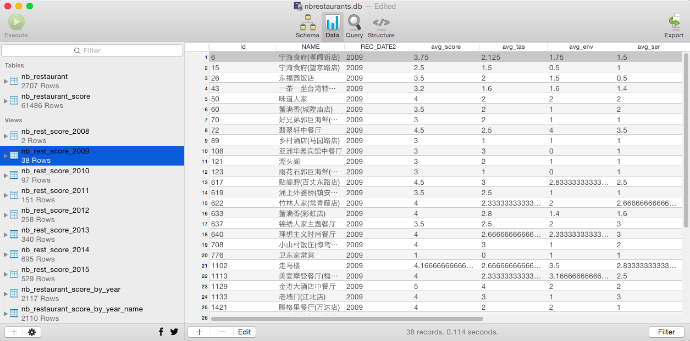

数据可视化
-----------------
1、生产数据
-----------------
我们现在可以生产两类数据：一是将nb_restaurant中的数据导出为csv格式，以形成当前状态下的宁波6区的餐厅分布位置图（包含各种有用的信息）
二是可以在sqlite中执行以下SQL语句（从2008至2015）：

    create view nb_rest_score_2015
    as
    select * from nb_restaurant_score_by_year_name where REC_DATE2='2015';
    

将这些数据导出。见data文件夹。