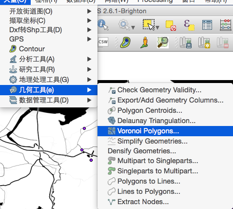
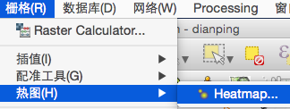
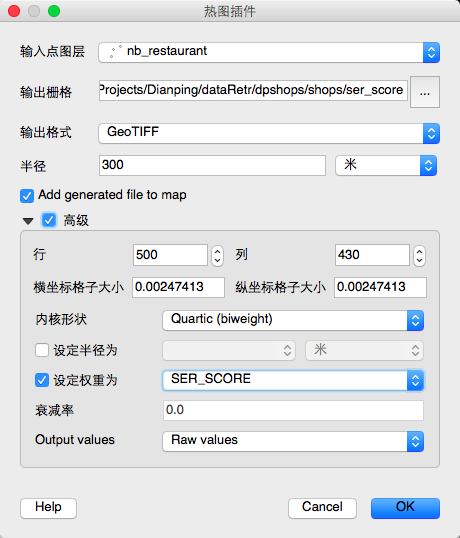
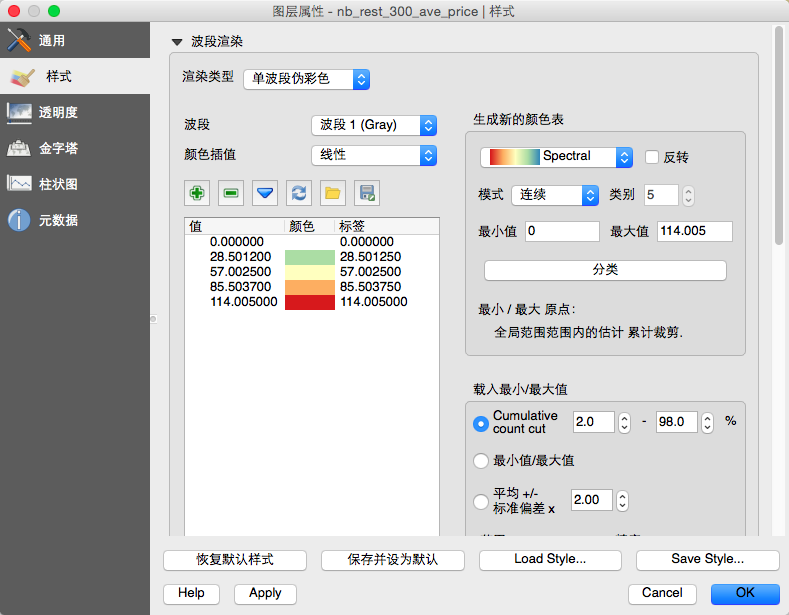

数据可视化
-----------------
1、生产数据
-----------------
我们现在可以生产两类数据：一是将nb_restaurant中的数据导出为csv格式，以形成当前状态下的宁波6区的餐厅分布位置图（包含各种有用的信息）
二是可以在sqlite中执行以下SQL语句（从2008至2015）：

    create view nb_rest_score_2015
    as
    select * from nb_restaurant_score_by_year_name where REC_DATE2='2015';
    

将这些数据导出。见data文件夹。

2、可视化
--------------------
加载csv数据

注意横纵坐标的字段

选择4326为坐标系

加载OSM数据为底层地图，如果QGIS上没有这一菜单，请安装OpenLayers plugin插件

调整图层次序

3、生成泰森多边形
-----------------------

设置多边形符号，即可将多边形添加到地图中

4、热力图
------------------------
首先需要安装heatmap插件

在存在CSV点数据的情况下，生成对应属性的热力图

生成的是一张单波段的栅格数据，进行伪色彩处理

